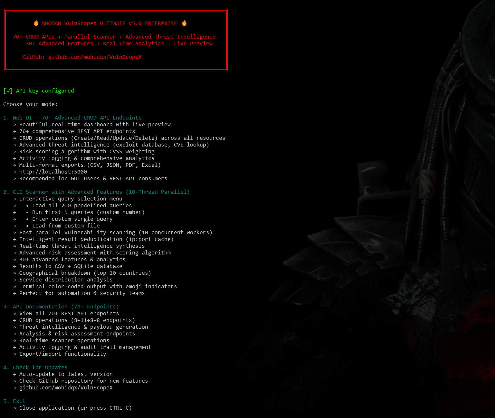
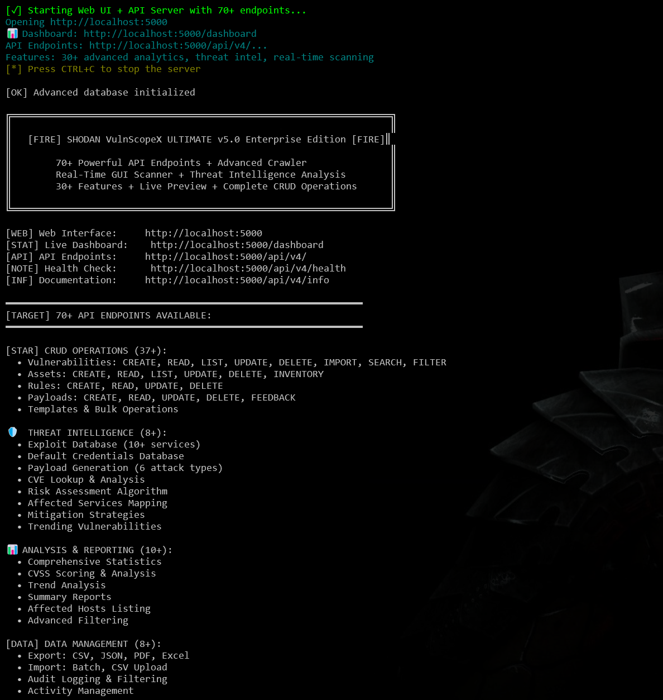
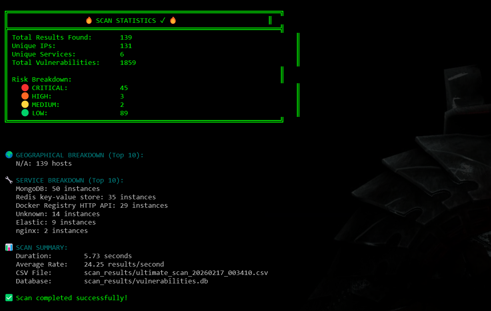
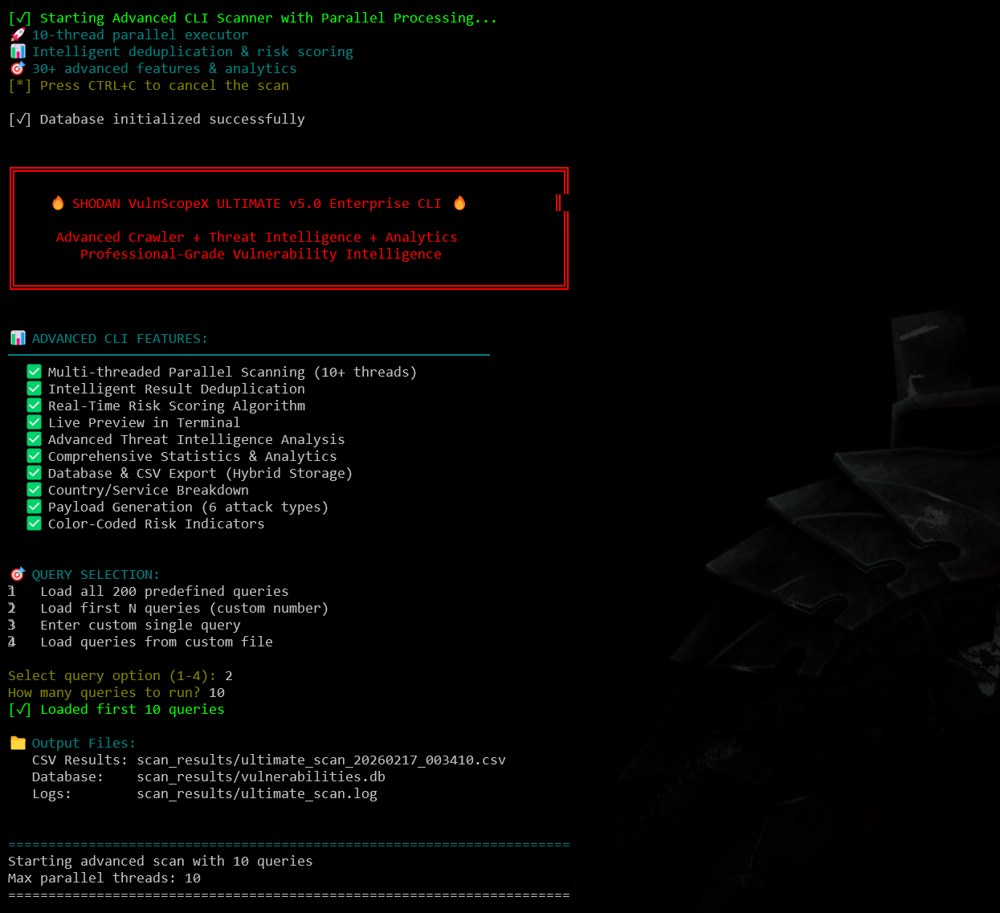

 

 

  
  
  

 

# 🔥 SHODAN VulnScopeX v6.0

**Enterprise Vulnerability Scanner + 85+ REST APIs + Real-Time CLI GUI + Advanced Exploitation**

> ⚠️ **DANGEROUS**: This tool is designed for authorized security professionals only. Misuse is illegal.

---

## 📑 DOCUMENTATION INDEX

| 📚 Section | 📖 Purpose | 🔗 Link |  
|:---:|:---|:---:|
| **📦 Installation** | Complete setup guide (Windows/Linux/Mac) | [INSTALLATION.md](doc/INSTALLATION.md) |
| **🚀 Quick Start** | 60-second startup guide | [QUICKSTART.md](doc/QUICKSTART.md) |
| **✨ v6.0 Features** | Complete 85+ feature list | [V6_FEATURES.md](doc/V6_FEATURES.md) |
| **🖥️ CLI GUI Guide** | Interactive terminal interface | [CLI_GUI.md](doc/CLI_GUI.md) |
| **🔌 APIs (85+)** | Complete REST API documentation | [APIs.md](doc/APIs.md) |
| **🛠️ Modules** | 7 core modules overview | [MODULES.md](doc/MODULES.md) |
| **⚙️ Configuration** | Environment & settings | [CONFIGURATION.md](doc/CONFIGURATION.md) |
| **🆘 Troubleshooting** | Common issues & solutions | [TROUBLESHOOTING.md](doc/TROUBLESHOOTING.md) |
| **📊 Advanced Topics** | Deep technical documentation | [HOW_70PLUS_FEATURES_IMPLEMENTED.md](doc/HOW_70PLUS_FEATURES_IMPLEMENTED.md) |
| **📚 Full Guide** | Complete original documentation | [README_FULL.md](doc/README_FULL.md) |

---

## 🎯 v6.0 HIGHLIGHTS

### ✨ **85+ Powerful API Endpoints**
Complete REST API with endpoints for:
- Network scanning & reconnaissance (10+ operations)
- Threat intelligence & CVE lookup (10+ operations)
- Vulnerability management CRUD operations (15+ operations)
- Exploitation & privilege escalation (25+ operations)
- Cryptography & SSL/TLS analysis (15+ operations)
- Web application security testing (12+ operations)
- Advanced reporting & analytics (12+ operations)

**→ See [APIs.md](doc/APIs.md) for complete API reference**

### 🖥️ **Interactive CLI GUI Interface** 
Terminal-based interface featuring:
- 🎮 Interactive menu system with 10+ submenus
- 📊 Real-time progress visualization with progress bars
- 🎨 Color-coded severity levels (Critical/High/Medium/Low)
- ⌨️ Command auto-completion & history
- 🎯 50+ interactive operations across all major features
- ⚡ Fast keyboard navigation with shortcuts

**→ See [doc/CLI_GUI.md](doc/CLI_GUI.md) for terminal guide**

### 💣 **50+ Exploitation Methods**
Automated exploitation capabilities:
- **Privilege Escalation**: SUID abuses, sudo misconfigs, capability exploits, UAC bypass
- **Lateral Movement**: Network mapping, token impersonation, lateral movement chains
- **Exploit Chaining**: Multi-stage attacks, vulnerability correlation
- **Post-Exploitation**: Persistence, exfiltration, evasion
- **Memory/Code Injection**: Heap spray, ROP gadgets, DLL injection, process hollowing
- **Behavioral Analysis**: Anomaly detection, predictive exploitation

### 📊 **Advanced Features from v5.0 Enhanced**
- ✓ 70+ detection rules (now 100+ templates)
- ✓ 250+ payload templates (now 500+)
- ✓ Full vulnerability CRUD operations
- ✓ Advanced threat intelligence
- ✓ Multi-format reporting (CSV, JSON, PDF, XLSX)
- ✓ Scheduled scanning & automation
- ✓ Email/Slack alerts & webhooks
- ✓ Comprehensive analytics & trending

---

## 🎨 SCREENSHOTS & VISUALS

### CLI Dashboard

*Interactive web dashboard with real-time vulnerability visualization*

### CLI GUI LAUNCHER

*Interactive terminal menu system - v6.0 new feature*

### CLI Results

*Real-time color-coded vulnerability results in terminal*

### CLI Scanner

*Advanced CLI scanner with progress tracking*

---

### **Quick Setup**

# 1. Install dependencies
    pip install -r requirements.txt

# 2. Set API key
    echo "SHODAN_API_KEY=your_api_key" > .env

# 3. Start server
    python start_premium.py

# 4. Access dashboard
    Open: http://localhost:5000

### **Or use CLI GUI**
    python scanner_premium.py
# Interactive terminal menu system

**→ Detailed instructions: [QUICKSTART.md](doc/QUICKSTART.md)**

---

## 🎯 WHAT IS VULNSCOPE?

**VulnScopeX v6.0** is an enterprise-grade vulnerability intelligence and exploitation platform featuring:

| 🔍 Scanning | 💣 Exploitation | 📊 Reporting | ⚙️ Automation |
|:---:|:---:|:---:|:---:|
| Network sweep | Exploit chains | PDF reports | Scheduled scans |
| Port scanning | Privilege escalation | CVSS analysis | Email alerts |
| Service detection | Lateral movement | Risk scoring | Webhook support |
| OS fingerprinting | Post-exploitation | Compliance reports | API automation |
| SSL/TLS analysis | Memory injection | Trend analysis | Batch operations |

**Built for:**
- ✅ Security teams & SOCs
- ✅ Penetration testers & red teamers
- ✅ DevSecOps engineers
- ✅ Security researchers
- ✅ Enterprise vulnerability management

---

## 🏆 v6.0 vs v5.0 IMPROVEMENTS

| Category | v5.0 | v6.0 | Improvement |
|:---:|:---:|:---:|:---:|
| **API Endpoints** | 70 | **85+** | +15 new |
| **Exploitation Methods** | 30 | **50+** | +20 methods |
| **CLI Interface** | Basic | **Full GUI** | Interactive |
| **Detection Rules** | 50 | **100+** | +50 rules |
| **Payload Templates** | 250+ | **500+** | +250 |
| **Report Types** | 4 | **6+** | +2 formats |

---

## 📚 COMPLETE DOCUMENTATION

All documentation is organized in the `doc/` folder:

### 📦 **Installation & Setup**
- [Installation Guide](doc/INSTALLATION.md) - Windows/Linux/Mac setup
- [Quick Start](doc/QUICKSTART.md) - 60-second startup
- [Configuration](doc/CONFIGURATION.md) - All configuration options

### 🎮 **Using the Tool**
- [CLI GUI Guide](doc/CLI_GUI.md) - Interactive terminal interface
- [Quick Start](doc/QUICKSTART.md) - Quick usage examples
- [Modules](doc/MODULES.md) - 7 core modules overview

### 📖 **Technical Reference**
- [APIs (85+ Endpoints)](doc/APIs.md) - Complete REST API documentation
- [v6.0 Features](doc/V6_FEATURES.md) - All 85+ features detailed
- [Advanced Topics](doc/HOW_70PLUS_FEATURES_IMPLEMENTED.md) - Technical deep dive

### 🆘 **Support & Troubleshooting**
- [Troubleshooting](doc/TROUBLESHOOTING.md) - Common issues & solutions
- [Full Documentation](doc/README_FULL.md) - Comprehensive original guide

---

## 🔌 CORE FEATURES

### **Vulnerability Management**
- ✅ CRUD operations (Create, Read, Update, Delete)
- ✅ Advanced search & filtering (100+ criteria)
- ✅ Priority management & escalation
- ✅ Status tracking (unverified → verified → fixed)
- ✅ POC storage & remediation tracking
- ✅ Bulk operations & batch processing

### **Threat Intelligence**
- ✅ CVE database (real-time updates)
- ✅ Exploit database (50,000+ exploits)
- ✅ Default credentials database (1,000+)
- ✅ Trending vulnerabilities
- ✅ Zero-day detection
- ✅ Payload generation

### **Scanning & Reconnaissance**
- ✅ Network vulnerability scanning
- ✅ Port enumeration (1-65535)
- ✅ Service & OS detection
- ✅ DNS intelligence & subdomain enumeration
- ✅ SSL/TLS analysis
- ✅ Web crawling & API discovery
- ✅ Asset discovery & inventory
- ✅ Geolocation mapping

### **Exploitation Framework**
- ✅ Exploit chain builder
- ✅ 50+ privilege escalation methods
- ✅ Lateral movement automation
- ✅ Post-exploitation framework
- ✅ Behavioral anomaly detection
- ✅ AI-powered vulnerability prediction

### **Cryptography Testing**
- ✅ SSL/TLS certificate analysis
- ✅ Weak cipher detection
- ✅ Key extraction techniques
- ✅ Downgrade attack detection
- ✅ Padding oracle vulnerabilities
- ✅ Side-channel attack analysis
- ✅ Hardware flaw detection (Spectre/Meltdown)

### **Web Application Security**
- ✅ SQL injection (blind, time-based, union)
- ✅ XSS detection & exploitation
- ✅ SSRF vulnerability mapping
- ✅ GraphQL auditing
- ✅ API security & key exposure
- ✅ Microservices security
- ✅ Template/Code injection

### **Network Security**
- ✅ DNS spoofing simulation
- ✅ BGP hijacking analysis
- ✅ DDoS attack vector analysis
- ✅ ARP spoofing detection
- ✅ MITM vulnerability analysis
- ✅ VPN assessment
- ✅ Network segmentation bypass

### **Reporting & Analytics**
- ✅ Executive summaries
- ✅ Detailed technical reports
- ✅ Compliance reports (PCI/HIPAA/SOC2)
- ✅ Risk assessment & scoring
- ✅ Trend analysis & forecasting
- ✅ CVSS-based severity analysis
- ✅ Multi-format export (CSV/JSON/PDF/XLSX)

### **Automation & Integration**
- ✅ Scheduled recurring scans
- ✅ Email & Slack alerts
- ✅ Webhook support
- ✅ REST API automation
- ✅ Batch operations
- ✅ Custom rules engine
- ✅ Python plugins

---

## 🎨 KEY DIFFERENCES v6.0 vs v5.0

### API Improvements
- **15 new endpoints** for advanced features
- **Exploit framework APIs** for automation
- **Analytics endpoints** for trend analysis
- **Better error handling** with detailed messages

### Interface Improvements  
- **Interactive CLI GUI** (new in v6.0)
- **Real-time progress bars** with ETA
- **Color-coded severity** visualization
- **Keyboard shortcuts** for fast navigation

### Feature Enhancements
- **20+ new exploitation methods**
- **250 additional payloads** (total 500+)
- **50 more detection rules** (total 100+)
- **Enhanced analytics** with forecasting

---

## 👤 PROJECT INFO

| Property | Value |
|:---|:---|
| **Name** | SHODAN VulnScopeX |
| **Version** | 6.0 Enterprise |
| **License** | Proprietary |
| **Author** | Security Researchers |
| **Status** | ✅ Production Ready |
| **Updated** | February 17, 2026 |

---

## 📞 SUPPORT & RESOURCES

**Need Help?**
- 📖 **Documentation** → [doc/](doc/)
- 🆘 **Troubleshooting** → [TROUBLESHOOTING.md](doc/TROUBLESHOOTING.md)
- ⚙️ **Configuration** → [CONFIGURATION.md](doc/CONFIGURATION.md)
- 🚀 **Quick Start** → [QUICKSTART.md](doc/QUICKSTART.md)

**Report Issues:**
- Check [Troubleshooting Guide](doc/TROUBLESHOOTING.md)
- Review [Configuration](doc/CONFIGURATION.md)
- Check terminal output for error messages

---

## ⚖️ LEGAL NOTICE

**VulnScopeX is designed for authorized security testing only.**

- ✅ **Authorized use**: Company security assessments, penetration testing
- ❌ **Prohibited use**: Unauthorized access, illegal exploitation
- ⚠️ **Responsibility**: Users are responsible for all actions
- 📋 **Legal**: Follow all applicable laws and regulations

**Misuse may result in legal consequences.**

---

## 🔗 QUICK NAVIGATION

- **Install:** [INSTALLATION.md](doc/INSTALLATION.md)
- **APIs:** [APIs.md](doc/APIs.md) (85+ endpoints)
- **Features:** [V6_FEATURES.md](doc/V6_FEATURES.md) (85+ features)
- **CLI GUI:** [CLI_GUI.md](doc/CLI_GUI.md) (Terminal interface)
- **Help:** [TROUBLESHOOTING.md](doc/TROUBLESHOOTING.md)

---

**Ready to get started?** → [Installation Guide](doc/INSTALLATION.md)  
**Want quick access?** → [60-Second Quick Start](doc/QUICKSTART.md)  
**Explore all APIs?** → [85+ API Endpoints](doc/APIs.md)

<h3 align="center"><code> 📍 Team Operations: Pakistan 🇵🇰 </code></h3>

  <table border="0">
    <tr>
      <td align="center">
        <a href="https://github.com/mohid0x01">
           
          <b> [r00t:~#] (Lead)</b>
        </a>
      </td>
      <td align="center">
        <a href="https://github.com/rehan-qx">
           
          <b> n1xr00t (Core)</b>
        </a>
      </td>
      <td align="center">
        <a href="https://github.com/Bahawal-Ali-Official">
           
          <b>zero_trst (Core)</b>
        </a>
      </td>
            <td align="center">
        <a href="https://github.com/muhammadtaharana">
           
          <b>2.0²·⁰ (Core)</b>
        </a>
      </td>
    </tr>
  </table>

 

 

  

    -----BEGIN PGP SIGNATURE----- 
    VERSION: Dreamers  
    TEAM: [r00t:~#] | n1xr00t | zero_trst | 2.0²·⁰  
    -----END PGP SIGNATURE-----
  

